<!-- HERO BANNER — Bento Grid -->
<p align="center">
  
</p>

<div align="center">


</div>

<br/>

<!-- ═══════════════════════════════════════════════════════════════ -->
<!-- ABOUT ME SECTION -->
<!-- ═══════════════════════════════════════════════════════════════ -->

<table>
<tr>
<td width="55%" valign="top">

### 🧠 About Me

I'm a **Computer Science student** focused on building **AI systems** that solve real problems — not just sit as projects.

I turn complex ideas into **simple, usable products**, especially in AI, automation, and intelligent systems.

> *"I'm more interested in building things that matter than just learning how they work."*

```yaml
Location:    Building the future 🌍
Focus:       AI Systems & Automation
Philosophy:  Ship fast, iterate faster
Motto:       Build → Ship → Repeat 🚀
```

</td>
<td width="45%" valign="top">

### ⚡ Quick Glance

| | |
|---|---|
| 🔭 **Working on** | AI systems & automation tools |
| 👯 **Open to** | AI products & real-world projects |
| 🤝 **Need help with** | Scaling & accuracy |
| 🌱 **Learning** | Advanced AI, system design |
| 💬 **Ask me about** | AI, Firebase, automation, products |
| 🎯 **Goal** | Build AI that matters |

</td>
</tr>
</table>

<br/>

<!-- ═══════════════════════════════════════════════════════════════ -->
<!-- CONNECT WITH ME -->
<!-- ═══════════════════════════════════════════════════════════════ -->

<div align="center">

## 🔗 Let's Connect

<br/>

<a href="https://linkedin.com/in/umar-farooque88">
  
</a>
&nbsp;&nbsp;
<a href="https://x.com/umarfaruk1026">
  
</a>
&nbsp;&nbsp;
<a href="https://instagram.com/umar.farxoq">
  
</a>
&nbsp;&nbsp;
<a href="mailto:umarfaruk1026@gmail.com">
  
</a>
&nbsp;&nbsp;
<a href="https://github.com/umarfarooque88">
  
</a>

<br/><br/>


</div>

<br/>


<br/>

<!-- ═══════════════════════════════════════════════════════════════ -->
<!-- TECH STACK -->
<!-- ═══════════════════════════════════════════════════════════════ -->

<div align="center">

## 🛠️ Tech Stack & Tools

*Technologies I use to bring ideas to life*

</div>

<br/>

<!-- LANGUAGES -->
<details open>
<summary><h3>💻 Programming Languages</h3></summary>

<br/>

<div align="center">


</div>

</details>

<!-- FRONTEND -->
<details open>
<summary><h3>🎨 Frontend & UI Frameworks</h3></summary>

<br/>

<div align="center">


</div>

</details>

<!-- BACKEND -->
<details open>
<summary><h3>⚙️ Backend & Runtime</h3></summary>

<br/>

<div align="center">


</div>

</details>

<!-- AI & DATA -->
<details open>
<summary><h3>🤖 AI & Data Science</h3></summary>

<br/>

<div align="center">


</div>

</details>

<!-- CLOUD & DEVOPS -->
<details open>
<summary><h3>☁️ Cloud & DevOps</h3></summary>

<br/>

<div align="center">


</div>

</details>

<!-- DESIGN -->
<details open>
<summary><h3>🎯 Design & Creative Tools</h3></summary>

<br/>

<div align="center">


</div>

</details>

<!-- VERSION CONTROL & PRODUCTIVITY -->
<details open>
<summary><h3>🔧 Version Control & Productivity</h3></summary>

<br/>

<div align="center">


</div>

</details>

<br/>


<br/>

<!-- ═══════════════════════════════════════════════════════════════ -->
<!-- GITHUB STATS -->
<!-- ═══════════════════════════════════════════════════════════════ -->

<div align="center">


</div>

<br/>


<br/>

<!-- ═══════════════════════════════════════════════════════════════ -->
<!-- FEATURED PROJECTS -->
<!-- ═══════════════════════════════════════════════════════════════ -->

<div align="center">

## 🚀 Featured Projects

*What I've been building — real products, real impact*

</div>

<br/>

<!-- PROJECT ROW 1 -->
<table>
<tr>
<td width="50%" valign="top">

### 🤖 Self-Hosted AI API
> *A comprehensive AI API solution built with Python*

A self-hosted alternative to commercial AI API services. Deploy your own AI endpoints with full control over models, data, and costs. No vendor lock-in.

**Tech:** `Python` `Jupyter` `FastAPI` `AI/ML`

[](https://github.com/umarfarooque88/self-hosted-ai-api)


</td>
<td width="50%" valign="top">

### 📱 LinkedIn Content Machine
> *AI-powered daily content generation system*

Automated LinkedIn content pipeline — research trends, generate posts, and build your personal brand on autopilot. AI does the heavy lifting.

**Tech:** `JavaScript` `Node.js` `AI` `Automation`

[](https://github.com/umarfarooque88/linkedin-content-machine)

</td>
</tr>
</table>

<!-- PROJECT ROW 2 -->
<table>
<tr>
<td width="50%" valign="top">

### 🏥 Medical Triage System
> *Voice-based AI medical assessment platform*

An intelligent voice-based medical triage platform powered by AI. Uses NLP to collect symptoms, prioritize patients, and provide emergency guidance in real-time.

**Tech:** `Python` `AI/NLP` `Voice Recognition` `FastAPI`

[](https://github.com/umarfarooque88/medical-triage-system)

</td>
<td width="50%" valign="top">


### ⚔️ Die On This Hill
> *Debate-first opinion accountability platform*

Post your unpopular opinion, others vote for or against — and votes are **permanent**. No switching sides, no edits. Where convictions are tested publicly.

**Tech:** `TypeScript` `React` `Firebase` `Real-time`

[](https://github.com/umarfarooque88/die-on-this-hill)

</td>
</tr>
</table>

<!-- PROJECT ROW 4 -->
<table>
<tr>
<td width="50%" valign="top">

### 📧 ColdOutreach AI
> *All-in-one cold email system for freelancers*

AI-generated emails, Gmail API integration, client finding via Google Maps API, automated follow-ups, and complete outreach tracking — all in one dashboard.

**Tech:** `JavaScript` `Node.js` `Gmail API` `Maps API`

[](https://github.com/umarfarooque88/ColdOutreach)


</td>
<td width="50%" valign="top">


### 🛒 StreetSupplyHub
> *Street-level supply chain platform*

A marketplace platform connecting local street vendors and suppliers. Streamlined operations for small-scale retail and distribution management.

**Tech:** `Web` `JavaScript` `Full Stack`

[](https://github.com/umarfarooque88/StreetSupplyHub)

</td>
</tr>
</table>

<br/>


<br/>

<!-- ═══════════════════════════════════════════════════════════════ -->
<!-- WHAT I DO BEST -->
<!-- ═══════════════════════════════════════════════════════════════ -->

<div align="center">

## 💡 What I Do Best

</div>

<br/>

<table>
<tr>
<td width="50%" align="center">

**🤖 AI Engineering**

Building intelligent systems that automate, predict, and adapt. From NLP to CV — turning data into decisions.

</td>
<td width="50%" align="center">

**🚀 Product Building**

Full-stack development with a product mindset. I ship features that users love, not just code that compiles.

</td>
</tr>
<tr>
<td width="50%" align="center">

**🎨 UI/UX Design**

Designing interfaces that feel natural and look stunning. Every pixel matters when building for humans.

</td>
<td width="50%" align="center">

**⚡ Automation**

Making repetitive work disappear. APIs, bots, scrapers, pipelines — if it can be automated, it will be.

</td>
</tr>
</table>

<br/>


<br/>

<!-- ═══════════════════════════════════════════════════════════════ -->
<!-- SUPPORT / FOOTER -->
<!-- ═══════════════════════════════════════════════════════════════ -->

<div align="center">

## 💖 Support My Work

If you find my projects useful or inspiring, consider giving them a ⭐

It motivates me to keep building and shipping!

<br/>

<a href="https://linkedin.com/in/umar-farooque88">
  
</a>
&nbsp;&nbsp;
<a href="https://x.com/umarfaruk1026">
  
</a>

<br/><br/>

### 💬 *"The best way to predict the future is to build it."*

<br/>


</div>
